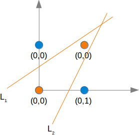

# neural-network
Everything related to the neural networks I really need to explore

_**NeuralNetwork class**_:  
NeuralNetwork(V, H, O, LR)
* V - _input matrix_
* H - _hidden layers tuple_ - (i.e. (2,) tuple means one hidden layer with 2 neurons)
* O - _output matrix_ - expected output
* LR - _learning_rate_ - rate of descending to minimum
  
_**Activation functions**_:  
* Sigmoid
* ReLU
* ELU
* Tanh
  
To change activation function for a layer (example with ELU):
```
def ELU(x):
    return max(x, 0.1 * (np.exp(x) - 1))


def ELU_p(x):
    return max(1, 0.1 * (np.exp(x)))

act = np.vectorize(ELU)
act_p = np.vectorize(ELU_p)
nn = NeuralNetwork(2, (4,), 1, learning_rate=0.01)
for layer in nn.layers:
    layer.act = act
    layer.act_p = act_p
```

Launch **nn.py** to see XOR problem solved by a Neural Network:
```
python3 nn.py
```
  
## XOR problem
  
XOR problem is special for neural networks because it is not **linearly separable**.  
This means that it is not possible to put one straight line between points (image above) in order to distinguish two types of colors.  

| Input1 | Input2 | XOR output |
| :----: | :----: | :--------: |
| 0      | 0      | `0`        |
| 0      | 1      | `1`        |
| 1      | 0      | `1`        |
| 1      | 1      | `0`        |
   
**Gradient Descent** calculations are in *photos/* folder

For activation function I used **Sigmoid** (or *ReLU*).  
Error function is called **Mean Squared loss function**.
